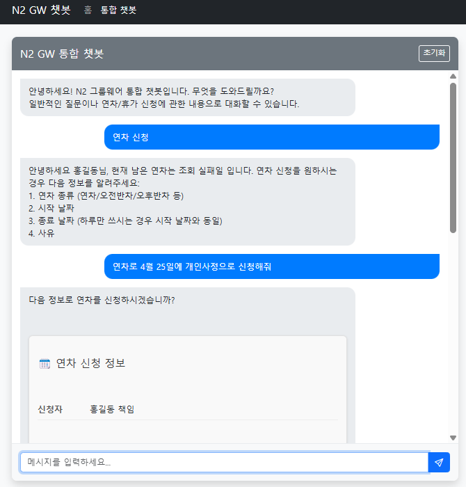
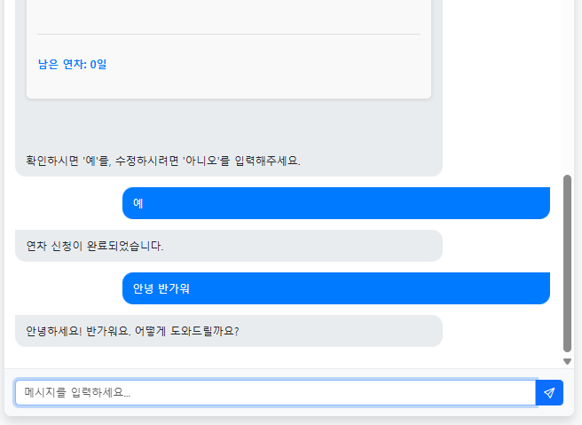

# N2 그룹웨어 결재 에이전트 (Approval Agent)

## 프로젝트 개요

결재 에이전트(Approval Agent)는 그룹웨어 시스템의 결재 프로세스를 자연어 인터페이스를 통해 접근할 수 있게 해주는 LLM 기반의 대화형 에이전트 시스템입니다. 이 프로젝트는 특히 연차 신청 워크플로우에 중점을 두고 있으며, 사용자가 자연어로 연차를 신청하고 관리할 수 있는 직관적인 인터페이스를 제공합니다.



## 핵심 기능

### 대화형 연차 신청 프로세스
- **자연어 인식**: "내일 연차 신청해줘", "4월 20일부터 21일까지 휴가 신청" 등의 자연어 명령을 인식하고 처리
- **정보 추출**: 날짜, 연차 유형, 사유 등의 정보를 자연스러운 대화에서 추출
- **검증 및 확인**: 추출된 정보를 시각적으로 제시하고 사용자 확인 요청
- **API 연동**: 그룹웨어 API와 연동하여 실제 결재 신청 처리



### API 에이전트
- 그룹웨어 API 자연어 인터페이스 제공
- 결재 양식 목록 조회, 결재 문서 승인, 잔여 휴가일수 확인 등의 기능 제공

## 기술 스택

### 백엔드
- **FastAPI**: 고성능 비동기 웹 프레임워크
- **LangChain**: LLM 애플리케이션을 구축하기 위한 프레임워크
- **LangGraph**: 상태 기반 대화 흐름 관리를 위한 프레임워크
- **OpenAI API (GPT-4/GPT-4o)**: 자연어 처리 및 생성

### 프론트엔드
- **HTML/JavaScript**: 웹 인터페이스
- **Jinja2**: 서버 사이드 템플릿 엔진

## 시스템 아키텍처

```
┌───────────────┐     ┌───────────────┐     ┌───────────────┐
│  사용자 요청  │────>│  FastAPI 서버  │────>│  세션 관리    │
└───────────────┘     └───────┬───────┘     └───────────────┘
                             │
                      ┌──────▼───────┐
                      │   LangGraph  │
                      │   워크플로우  │
                      └──────┬───────┘
                             │
       ┌───────────────────┬─┴─────────────┬───────────────────┐
       │                   │               │                   │
┌──────▼───────┐    ┌──────▼───────┐ ┌─────▼────────┐  ┌──────▼───────┐
│  정보 수집   │    │  정보 추출   │ │  정보 확인   │  │  결재 제출   │
└──────┬───────┘    └──────┬───────┘ └─────┬────────┘  └──────┬───────┘
       │                   │               │                   │
       └───────────────────┴───────────────┴───────────────────┘
                             │
                      ┌──────▼───────┐
                      │ 그룹웨어 API  │
                      └───────────────┘
```

## 주요 컴포넌트

### 1. 그래프 기반 워크플로우
- **Supervisor**: 사용자 의도를 파악하고 적절한 워크플로우로 라우팅
- **Vacation Flow**: 
  - **Collector**: 초기 정보 수집 (직원 정보, 잔여 연차, 결재 라인)
  - **Extractor**: 자연어에서 연차 정보 추출 및 검증
  - **Confirmer**: 사용자 확인 및 수정 처리
  - **Submitter**: 최종 제출 및 결과 처리

### 2. 세션 관리
- 사용자별 세션 상태 유지
- 대화 컨텍스트 및 연차 정보 관리
- 체크포인트 기반 상태 복원

### 3. API 클라이언트
- 그룹웨어 API와의 통신
- 연차 신청, 직원 정보 조회, 결재 라인 조회 등 처리

## 설치 및 실행 방법

### 요구사항
- Python 3.9 이상
- OpenAI API 키

### 설치 방법

1. 저장소 복제
```bash
git clone <repository-url>
cd approval_agent/gw_agent
```

2. 가상 환경 생성 및 활성화
```bash
python -m venv .venv
# Windows
.venv\Scripts\activate
# Linux/Mac
source .venv/bin/activate
```

3. 의존성 설치
```bash
pip install -r requirements.txt
```

4. 환경 변수 설정
`.env` 파일을 생성하고 다음 내용 추가:
```
OPENAI_API_KEY=your_openai_api_key
BASE_URL=your_groupware_api_base_url
```

### 실행 방법

```bash
uvicorn main:app --reload
```

웹 브라우저에서 `http://localhost:8000` 접속

## 사용 예시

### 연차 신청 예시
```
사용자: 4월 20일 연차 신청하고 싶어요
에이전트: 다음 정보로 연차를 신청하시겠습니까?
         연차 종류: 연차
         시작일: 2023-04-20
         종료일: 2023-04-20

사용자: 네, 신청해주세요
에이전트: 연차 신청이 완료되었습니다.
```

## 기술적 특징

1. **LangGraph를 활용한 대화 흐름 관리**
   - 상태 기반 대화 처리로 복잡한 대화 흐름 구현
   - 조건부 분기 처리로 유연한 대화 시나리오 제공

2. **컨텍스트 인식 대화 처리**
   - 이전 대화 기록을 고려한 자연스러운 대화 흐름
   - 사용자 의도 파악 및 적절한 워크플로우 라우팅

3. **모듈화된 아키텍처**
   - 확장 가능한 노드 기반 설계
   - 새로운 워크플로우 및 기능 추가 용이

4. **세션 기반 상태 관리**
   - 사용자별 대화 컨텍스트 유지
   - 중단된 대화 복원 지원

## 미래 개선 방향

1. **다양한 결재 유형 지원**
   - 출장, 비용 청구 등 추가 결재 유형 통합
   - 복잡한 결재 워크플로우 지원

2. **성능 최적화**
   - LLM 호출 최소화로 응답 시간 개선
   - 사용자 인터페이스 개선

3. **다국어 지원**
   - 영어, 일본어 등 다양한 언어 지원
   - 지역별 날짜 형식 처리
