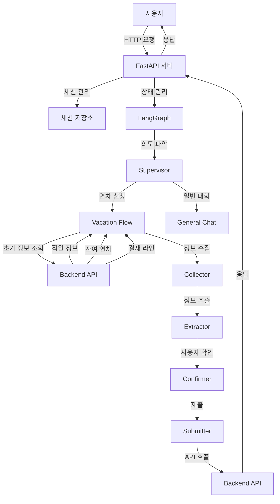

# GW Agent 아키텍처 개요

## 시스템 다이어그램

## LangGraph 워크플로우

GW Agent는 LangGraph를 사용하여 대화 흐름을 관리합니다. 주요 노드와 상태 전이는 다음과 같습니다:

1. **Supervisor**: 사용자 의도를 파악하고 적절한 워크플로우로 라우팅
2. **Vacation Flow**: 연차 신청 프로세스 관리
   - 초기 정보 조회: 직원 정보, 잔여 연차, 결재 라인 조회
   - Collector: 기본 정보 수집 및 초기화
   - Extractor: 자연어에서 정보 추출 및 검증
   - Confirmer: 사용자 확인 및 수정 처리
   - Submitter: 최종 제출 및 결과 처리
3. **General Chat**: 일반적인 대화 처리

## 핵심 의존성

| 의존성 | 버전 | 용도 |
|--------|------|------|
| FastAPI | 0.104.1 | REST API 서버 |
| LangChain | 0.0.350 | LLM 통합 |
| LangGraph | 0.0.15 | 대화 흐름 관리 |
| OpenAI | 1.3.0 | GPT-4 모델 |
| Pydantic | 2.5.2 | 데이터 검증 |
| Uvicorn | 0.24.0 | ASGI 서버 | 