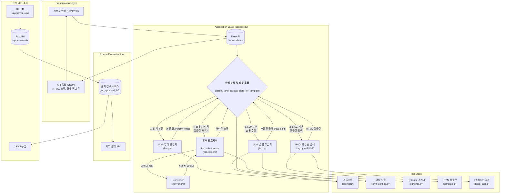

# 전자결재 양식 자동 추천 및 완성 시스템

## 1. 프로젝트 개요 (Overview)

본 프로젝트는 사용자의 자연어 입력을 이해하여, 다양한 전자결재 양식 중 가장 적합한 것을 추천하고, 입력 내용에서 주요 정보를 추출하여 해당 양식에 자동으로 채워주는 시스템입니다. 이를 통해 사용자는 반복적인 문서 작성 시간을 줄이고 업무 효율성을 높일 수 있습니다.

**주요 기능:**
- **자연어 기반 양식 추천**: 사용자의 요청을 분석하여 가장 적절한 전자결재 양식을 자동으로 분류합니다.
- **LLM 기반 정보 추출 (Slot Filling)**: 입력된 내용에서 날짜, 금액, 사유 등 주요 정보를 지능적으로 추출합니다.
- **RAG 기반 템플릿 검색**: FAISS 벡터 DB에 저장된 HTML 템플릿 중 사용자의 요청과 가장 관련성 높은 양식을 검색하여 제공합니다.
- **동적 템플릿 완성**: 추출된 정보를 HTML 템플릿에 동적으로 채워넣어 완성된 문서를 생성합니다.
- **외부 API 연동**: 결재자 정보 조회, 최종 결재 상신 등 외부 시스템과 연동하여 동작합니다.
- **상대적/절대적 날짜 표현 자동 변환** (예: "내일", "다음 주 월요일" -> "YYYY-MM-DD")

### 예시 화면

다음은 `01_agents/form-selector` 시스템의 주요 기능에 대한 예시 화면입니다.

1.  **양식 선택 및 내용 입력 UI**
    *   사용자가 자연어로 "다음 주 월요일부터 3일간 연차 쓰고 싶어요. 사유는 가족 여행입니다."와 같이 특정 업무(예: 연차 신청)를 요청하면, 시스템은 해당 요청의 의도를 파악하여 '연차 신청서' 양식을 자동으로 선택합니다. 동시에 대화 내용에서 "다음 주 월요일" (시작일), "3일간" (기간), "가족 여행" (사유) 등의 핵심 정보를 추출하여, 아래 그림과 같이 해당 양식의 각 항목을 자동으로 완성된 형태로 사용자에게 제공합니다.
    

2.  **LLM 기반 양식 추천 및 슬롯 필링 결과**
    *   사용자의 요청이 특정 양식(예: 연차)에 국한되지 않고, 다양한 업무 관련 요청일 경우에도 LLM은 요청의 맥락(예: "구매")을 이해하고 키워드 기반의 RAG 검색을 통해 가장 적합한 전자결재 양식(예: '비품/소모품 구매 요청서')을 지능적으로 추천합니다. 또한, 입력된 자연어에서 "A4용지 10박스", "네임펜 20개"(구매 품목 및 수량), "연구실 사용"(사용 목적) 등의 필요한 정보를 입력한 경우에도 정확히 추출(Slot Filling)하여 해당 양식의 필드를 자동으로 채워줍니다.
    

3.  **결재자 정보 표시**
    *   시스템에서 양식이 추천되고 내용이 채워지면, 해당 양식의 종류(예: '연차 신청서', '비품/소모품 구매 요청서')와 내부 식별자(Form ID), 그리고 기안자 정보를 기반으로, 사전에 정의된 결재 규칙 또는 외부 API 연동을 통해 결재 라인(기안자 정보, 결재자 목록, 결재 구분, 순서)이 자동으로 조회됩니다. 이 정보는 화면 상단에 명확하게 표시되어, 사용자가 해당 문서의 결재 흐름을 한눈에 파악할 수 있도록 지원합니다.
    


## 2. 기술 스택 (Tech Stack)

- **Backend**: Python 3.10+, FastAPI, LangChain, Pydantic, Uvicorn
- **Frontend**: HTML5, CSS3, JavaScript (ES6+)
- **LLM**: OpenAI GPT-4o (또는 호환 모델)
- **Vector Store (RAG)**: FAISS

## 3. 시스템 아키텍처 (System Architecture)



**아키텍처 흐름 설명:**

1.  **입력 및 라우팅**: 사용자의 자연어 입력은 FastAPI 엔드포인트 (`/form-selector`)로 전달됩니다.
2.  **양식 분류 (Classification)**: `service.py`의 `classify_and_extract_slots_for_template` 함수가 호출됩니다. LangChain으로 구현된 '양식 분류기'(`llm.py`)가 입력 텍스트를 분석하여 가장 적합한 양식 타입(`form_type`)을 결정합니다.
3.  **템플릿 검색 (RAG)**: 결정된 `form_type`을 기반으로 `rag.py`가 FAISS 벡터 스토어에서 가장 유사한 HTML 템플릿을 검색합니다.
4.  **정보 추출 (Slot Filling)**: 해당 `form_type`에 맞는 '슬롯 추출기'(`llm.py`)가 사용자 입력에서 필요한 데이터(날짜, 금액 등)를 추출하여 Pydantic 모델(`schema.py`)에 담습니다.
5.  **데이터 처리 (Processing)**: 추출된 원본 슬롯 데이터는 `form_type`에 맞는 `Processor`(`form_selector/processors/`)로 전달됩니다. `Processor`는 내부 `Converter`(`form_selector/converters/`)를 사용하여 날짜, 숫자 등을 표준 형식으로 변환하고, 비즈니스 로직에 따라 데이터를 가공합니다.
6.  **템플릿 완성 및 응답**: 처리된 최종 슬롯 데이터가 검색된 HTML 템플릿에 채워지고, 완성된 HTML과 함께 JSON 형식으로 클라이언트에 반환됩니다.
7.  **결재 라인 조회**: UI에서 `/approver-info` 엔드포인트를 호출하면, `service.py`의 `get_approval_info` 함수가 외부 결재 API와 통신하여 결재자 정보를 가져와 UI에 표시합니다.

## 4. 디렉토리 구조 (Directory Structure)

```
form-selector/
├── form_selector/          # 핵심 백엔드 애플리케이션 패키지
│   ├── __init__.py
│   ├── application/        # 애플리케이션 서비스 계층 (미래 확장용)
│   ├── domain/             # 도메인 모델 및 비즈니스 로직 (미래 확장용)
│   ├── infrastructure/     # 외부 시스템 연동 (미래 확장용)
│   ├── presentation/       # API 엔드포인트, 요청/응답 처리 (미래 확장용)
│   │
│   ├── processors/         # 양식별 데이터 처리기
│   │   ├── base_processor.py
│   │   └── ... (각 양식별 Processor)
│   ├── converters/         # 데이터 타입 변환기 (날짜, 필드명 등)
│   │   ├── base_converter.py
│   │   └── ...
│   ├── prompts/            # LLM 프롬프트 템플릿
│   ├── validators/         # 데이터 유효성 검증 (미래 확장용)
│   │
│   ├── service.py          # 핵심 서비스 로직 (양식 분류, 슬롯 추출, API 연동)
│   ├── llm.py              # LangChain LLM 체인 구성
│   ├── schema.py           # Pydantic 모델 (데이터 스키마 정의)
│   ├── rag.py              # RAG 로직 (FAISS 기반 HTML 템플릿 검색)
│   ├── utils.py            # 유틸리티 함수
│   └── form_configs.py     # 양식별 설정 (템플릿 경로, 프로세서 매핑 등)
│
├── static/                 # 프론트엔드 정적 파일 (HTML, CSS, JS)
├── templates/              # HTML 양식 템플릿
├── faiss_index/            # FAISS 벡터 스토어 인덱스
│
├── main.py                 # FastAPI 애플리케이션 진입점
├── requirements.txt        # Python 의존성 목록
├── .env.example            # 환경 변수 예시 파일
└── README.md               # 프로젝트 설명 문서 (현재 파일)
```

## 5. 설치 및 실행 방법 (Setup and Run)

1.  **저장소 복제 (Clone Repository):**
    ```bash
    git clone <repository_url>
    cd form-selector
    ```

2.  **가상 환경 생성 및 활성화:**
    ```bash
    python -m venv .venv
    # Windows
    .venv\Scripts\activate
    # macOS/Linux
    source .venv/bin/activate
    ```

3.  **필수 라이브러리 설치:**
    ```bash
    pip install -r requirements.txt
    ```

4.  **환경 변수 설정:**
    `.env.example` 파일을 복사하여 `.env` 파일을 생성하고, 실제 OpenAI API 키 등 필요한 환경 변수를 설정합니다.
    ```bash
    cp .env.example .env
    ```
    ```env
    # .env
    OPENAI_API_KEY="sk-your_openai_api_key_here"
    APPROVAL_API_BASE_URL="https://your-approval-api/api/v1"
    ```

5.  **애플리케이션 실행:**
    ```bash
    uvicorn main:app --reload --port 8000
    ```

6.  **애플리케이션 접속:**
    웹 브라우저에서 `http://127.0.0.1:8000/ui/login.html` 로 접속합니다.


## 5. 주요 기능 상세 설명 (Features)

-   **양식 추천 (Form Recommendation):**
    1.  사용자가 자연어로 원하는 업무를 입력합니다 (예: "다음 주 월요일부터 3일간 연차 쓰고 싶어요").
    2.  양식 분류 LLM 체인(`llm.py`의 `get_form_classifier_chain`)이 입력을 분석하여 가장 적합한 양식의 종류(예: "연차 신청서")와 검색 키워드를 추출합니다.
    3.  추출된 양식 종류와 키워드를 `rag.py`의 `retrieve_template` 함수로 전달하여, FAISS 벡터 스토어에 인덱싱된 HTML 템플릿 중 가장 유사한 것을 검색합니다.

-   **정보 자동 채우기 (Slot Auto-filling):**
    1.  분류된 양식 종류에 해당하는 슬롯 추출 LLM 체인(`llm.py`의 `SLOT_EXTRACTOR_CHAINS`)이 사용자 입력으로부터 필요한 정보들(예: 휴가 시작일, 기간, 사유)을 추출합니다.
    2.  `service.py`의 `fill_slots_in_template` 함수는 추출된 슬롯 값들을 처리합니다:
        -   **날짜/시간 변환**: LLM이 추출한 자연어 날짜/시간 표현을 표준 형식으로 변환하기 위해 `form_selector/utils.py`의 파싱 함수들을 사용합니다. 주요 파싱 로직은 다음과 같습니다:
            -   `parse_relative_date_to_iso` (주로 "YYYY-MM-DD" 형식 반환):
                1.  **규칙 기반 1차 변환**: "오늘", "내일", "다음 주 월요일", "2023년 12월 25일" 등 비교적 명확한 날짜 표현을 `dateutil` 라이브러리 및 내부 규칙을 통해 우선적으로 파싱합니다.
                2.  **LLM 기반 2차 변환**: 1차 규칙 기반 파싱으로 변환되지 못한 복잡하거나 모호한 표현에 대해, 해당 날짜 문자열과 현재 날짜 정보를 `_call_llm_for_datetime_parsing` 함수를 통해 LLM에 전달하여 "YYYY-MM-DD" 형식으로 변환을 시도합니다. LLM은 제공된 오늘 날짜를 기준으로 상대적인 날짜를 계산합니다.
            -   `parse_datetime_description_to_iso_local` (주로 "YYYY-MM-DDTHH:MM" 형식 반환):
        -   구매 품의서의 경우, 아이템 리스트 내 각 아이템의 `item_delivery_request_date` 키를 `item_delivery_date`로, `item_purpose` 키를 `item_notes`로 내부적으로 키 이름을 변경하여 처리합니다. (날짜 파싱은 키 변경 후 이루어짐)
        -   휴가 신청서의 `leave_type` (예: "오전 반차")과 같이 LLM이 자연어로 추출한 특정 슬롯 값을 HTML `<select>` 태그의 `value` (예: "half_day_morning")에 맞게 내부적으로 매핑(`LEAVE_TYPE_TEXT_TO_VALUE_MAP` 사용)합니다.
        -   야근 신청서의 `overtime_ampm` 값을 "AM" 또는 "PM"으로 표준화합니다.
        -   HTML 템플릿에 값을 채울 때 `re.sub`의 백슬래시 문제를 방지하기 위해 슬롯 값 내 백슬래시를 이스케이프 처리합니다.
        -   JavaScript로 전달될 다중 항목 데이터(예: 구매 품의서의 품목 리스트)는 JSON 문자열로 변환됩니다.
    3.  처리된 슬롯 값들은 검색된 HTML 템플릿 내의 해당 위치(플레이스홀더)에 삽입됩니다.

-   **결재자 정보 조회 (Approver Information Retrieval):**
    1.  양식 추천 및 슬롯 채우기가 완료된 후, 클라이언트(UI)는 해당 양식의 식별자(`mstPid`)와 기안자 ID(`drafterId`)를 `/approver-info` 또는 `/myLine` API 엔드포인트로 전송합니다.
    2.  `/approver-info` 엔드포인트는 내부 로직 또는 서비스(`service.py`의 `get_approval_info`)를 통해 결재자 정보를 조회합니다.
    3.  `/myLine` 엔드포인트는 환경 변수(`APPROVAL_API_BASE_URL`)에 설정된 외부 결재 API를 직접 호출하여 실시간으로 결재 라인 정보를 가져옵니다.
    4.  조회된 기안자 정보(이름, 부서) 및 결재자 목록(결재자 ID, 이름, 결재 구분, 순서)은 JSON 형식으로 클라이언트에 반환되어 화면에 표시됩니다.

-   **지원 양식 목록:**
    (현재 `form_configs.py`의 `AVAILABLE_FORM_TYPES` 리스트를 참고하여 작성 필요. 예시:)
    -   연차 신청서
    -   야근식대비용 신청서
    -   교통비 신청서
    -   파견 및 출장 보고서
    -   비품/소모품 구입내역서
    -   구매 품의서
    -   개인 경비 사용 내역서
    -   법인카드 지출내역서
    -   *(추가 예정 양식)*

-   **오류 처리:**
    -   LLM이 양식 분류에 실패하거나 슬롯 추출에 실패(파싱 오류 등)하는 경우, 사용자에게 적절한 안내 메시지를 포함한 JSON 응답을 반환합니다.
    -   요청된 양식의 HTML 템플릿을 찾을 수 없는 경우에도 오류를 반환합니다.


## 6. 향후 개선 방향 (Future Work)

-   **테스트 코드 작성**: 단위/통합 테스트를 통해 코드 안정성 및 신뢰성 확보
-   **사용자 인증/인가**: OAuth2 등을 이용한 보안 강화
-   **DB 연동**: 신청 내역 저장, 이력 관리 기능 추가
-   **비동기 처리 개선**: 외부 API 호출 등 I/O 바운드 작업을 Celery와 같은 태스크 큐로 분리하여 응답 성능 향상
-   **CI/CD 파이프라인 구축**: 테스트 및 배포 자동화
-   **모니터링 및 로깅 강화**: ELK 스택 또는 유사 솔루션을 도입하여 운영 가시성 확보 
