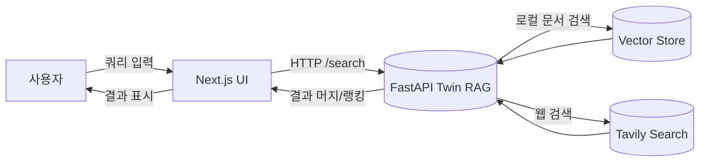

이 프로젝트는 [`EasyNext`](https://github.com/easynext/easynext)를 사용해 생성된 [Next.js](https://nextjs.org) 프로젝트입니다.

## Getting Started

개발 서버를 실행합니다.<br/>
환경에 따른 명령어를 사용해주세요.

```bash
npm run dev
# or
yarn dev
# or
pnpm dev
# or
bun dev
```

브라우저에서 [http://localhost:3000](http://localhost:3000)을 열어 결과를 확인할 수 있습니다.

`app/page.tsx` 파일을 수정하여 페이지를 편집할 수 있습니다. 파일을 수정하면 자동으로 페이지가 업데이트됩니다.

## 기본 포함 라이브러리

- [Next.js](https://nextjs.org)
- [React](https://react.dev)
- [Tailwind CSS](https://tailwindcss.com)
- [TypeScript](https://www.typescriptlang.org)
- [ESLint](https://eslint.org)
- [Prettier](https://prettier.io)
- [Shadcn UI](https://ui.shadcn.com)
- [Lucide Icon](https://lucide.dev)
- [date-fns](https://date-fns.org)
- [react-use](https://github.com/streamich/react-use)
- [es-toolkit](https://github.com/toss/es-toolkit)
- [Zod](https://zod.dev)
- [React Query](https://tanstack.com/query/latest)
- [React Hook Form](https://react-hook-form.com)
- [TS Pattern](https://github.com/gvergnaud/ts-pattern)

## 사용 가능한 명령어

한글버전 사용

```sh
easynext lang ko
```

최신버전으로 업데이트

```sh
npm i -g @easynext/cli@latest
# or
yarn add -g @easynext/cli@latest
# or
pnpm add -g @easynext/cli@latest
```

Supabase 설정

```sh
easynext supabase
```

Next-Auth 설정

```sh
easynext auth

# ID,PW 로그인
easynext auth idpw
# 카카오 로그인
easynext auth kakao
```

유용한 서비스 연동

```sh
# Google Analytics
easynext gtag

# Microsoft Clarity
easynext clarity

# ChannelIO
easynext channelio

# Sentry
easynext sentry

# Google Adsense
easynext adsense
```

## RAG 백엔드 캐시/웹검색 환경변수

FastAPI `/search` 엔드포인트는 동일한 파라미터의 요청에 대해 TTL 캐시를 적용합니다. 웹검색 공급자는 Tavily로 전환되었습니다.

- `RAG_CACHE_TTL_SEC`: 캐시 TTL(초). 기본값 `300`.
- `RAG_STORE_PATH`: 문서 벡터 저장 파일 경로. 테스트에서 임시 경로로 설정.
- `TAVILY_API_KEY`: Tavily Search API 키(필수).

예시:

```bash
export RAG_CACHE_TTL_SEC=300
export TAVILY_API_KEY=your-tavily-key
```

---

# 프로젝트 구동 가이드 (Full Stack)

아래 절차를 따라 프론트엔드(Next.js)와 RAG 백엔드(FastAPI)를 설치하고 실행합니다.

## 1) 요구사항
- Node.js 20+
- npm
- Python 3.11+

## 2) 환경 변수 설정
프론트엔드(Next.js)는 Supabase를 사용합니다. 루트 디렉터리에 `.env.local`을 생성하고 아래 값을 설정하세요.

```bash
# Next.js (클라이언트)
NEXT_PUBLIC_SUPABASE_URL=your-supabase-url
NEXT_PUBLIC_SUPABASE_ANON_KEY=your-supabase-anon-key

# RAG 백엔드 (옵션: 캐시/스토어/웹검색)
RAG_CACHE_TTL_SEC=300
RAG_STORE_PATH=.\twin_RAG\rag\data\vectors.npz
TAVILY_API_KEY=your-tavily-search-key
```

Windows PowerShell 세션에서 일시적으로 설정하려면:

```powershell
$env:NEXT_PUBLIC_SUPABASE_URL="your-supabase-url"
$env:NEXT_PUBLIC_SUPABASE_ANON_KEY="your-supabase-anon-key"
$env:RAG_CACHE_TTL_SEC="300"
$env:RAG_STORE_PATH=".\\twin_RAG\\rag\\data\\vectors.npz"
$env:TAVILY_API_KEY="your-tavily-search-key"
```

macOS/Linux 세션에서 일시적으로 설정하려면:

```bash
export NEXT_PUBLIC_SUPABASE_URL=your-supabase-url
export NEXT_PUBLIC_SUPABASE_ANON_KEY=your-supabase-anon-key
export RAG_CACHE_TTL_SEC=300
export RAG_STORE_PATH=./twin_RAG/rag/data/vectors.npz
export TAVILY_API_KEY=your-tavily-search-key
```

## 3) 설치

### 프론트엔드 (Next.js)
```bash
npm install
```

### RAG 백엔드 (FastAPI)
```bash
cd twin_RAG/rag
python -m venv .venv
# Windows PowerShell
. .venv/Scripts/Activate.ps1
# macOS/Linux
# source .venv/bin/activate

pip install -r requirements.txt
```

## 4) 실행

### 프론트엔드 실행
```bash
npm run dev
# 브라우저: http://localhost:3000
```

### RAG 백엔드 실행
다음 명령은 `twin_RAG/rag/src` 디렉터리에서 실행하세요.

```bash
cd twin_RAG/rag/src
uvicorn ragapi.main:app --reload --host 0.0.0.0 --port 8000
# 헬스체크: http://localhost:8000/health
# 검색 API:  http://localhost:8000/search?q=visa
```

### 로컬 문서 인덱싱 (하이브리드 테스트용)

샘플 문서를 추가/인덱싱하여 로컬+웹 하이브리드 검색을 검증합니다.

```bash
# 샘플 문서 위치
cat twin_RAG/rag/data/docs/sample_immigration.md

# 벡터 스토어 생성
python twin_RAG/rag/src/scripts/build_local_docs.py twin_RAG/rag/data/docs --store-path twin_RAG/rag/data/vectors.npz

# FastAPI가 해당 스토어를 사용하도록 환경 변수 지정 후 실행
set RAG_STORE_PATH=twin_RAG/rag/data/vectors.npz    # Windows PowerShell
export RAG_STORE_PATH=./twin_RAG/rag/data/vectors.npz # macOS/Linux
```

예시 질문(로컬+웹 함께 검증):
- "서울 출입국사무소 운영시간 알려줘" (로컬 문서에서 시간, 웹에서 최신 공지 보강)
- "E-7 비자 연장 예약 필요해?" (로컬 문서에 예약 권장 문구 존재)
- "점심시간엔 민원 접수 가능한가?" (로컬 문서: 제한적 서비스)

### 프록시(API 라우트)

Next.js API 라우트(`/api/search`)가 FastAPI `/search`를 프록시합니다.

환경변수 설정:

```bash
export RAG_SEARCH_URL=http://localhost:8000/search
```

브라우저/프론트엔드에서는 `/api/search?q=...`로 호출하세요.

Windows PowerShell에서 `uvicorn`이 인식되지 않으면 가상환경이 활성화되었는지 확인하세요.

## 5) 테스트

### 프론트엔드(Jest)
```bash
npm test
```

### 백엔드(Pytest)
```bash
cd twin_RAG/rag
pytest -q
```

## 6) 주요 기능 요약
- 검색: `src/features/search`의 `SearchContainer`를 통해 쿼리 입력 → 결과 리스트 표시
- RAG: FastAPI `/search`가 로컬 문서 임베딩 + 웹검색(Tavily) 하이브리드 랭킹 반환
- 캐시: 동일 파라미터 요청 TTL 캐시 적용(`RAG_CACHE_TTL_SEC`)

## 7) UI/UX 워크플로우 (Mermaid)



## 8) 스크린샷 (자리표시자)

> 실제 스크린샷 준비 전까지 유효한 placeholder 이미지를 사용합니다.


## 9) Supabase 설정 가이드(요약)
1. Supabase 프로젝트 생성 후 `Project URL`, `anon key` 확인
2. `.env.local`에 `NEXT_PUBLIC_SUPABASE_URL`, `NEXT_PUBLIC_SUPABASE_ANON_KEY` 설정
3. 서버 컴포넌트/SSR 사용 시 추가 키가 필요하다면 `src/lib/supabase/server.ts` 가이드를 참고해 환경변수를 분리 관리

## 12) 샘플 데이터 시드 및 마이그레이션

1. Supabase에서 다음 마이그레이션 SQL을 실행합니다: `supabase/migrations/20250822T000000_create_places.sql`
2. 환경변수 설정:

```bash
export SUPABASE_URL=your-project-url
export SUPABASE_SERVICE_ROLE_KEY=your-service-role-key
```

3. 샘플 데이터 삽입:

```bash
npx ts-node src/features/data/scripts/seed-places.ts
# 또는 파일 경로 지정
npx ts-node src/features/data/scripts/seed-places.ts src/features/data/sample/places.sample.json
```

### (옵션) 공공데이터 API → Place 변환/저장

서울시 병원(예시) API에서 JSON을 내려받아 내부 Place 포맷으로 변환 후 파일로 저장합니다.

```bash
# URL 인자 또는 환경변수 SEOUL_HOSPITALS_URL 사용
npx ts-node src/features/data/scripts/fetch-seoul-hospitals.ts "https://api.example.com/seoul/hospitals" ./src/features/data/sample/places.from_api.json
```


## 10) 크로스플랫폼 주의사항
- Windows PowerShell: 환경 변수는 `$env:KEY="value"`로 현재 세션에만 적용됩니다.
- macOS/Linux: `export KEY=value` 사용. 영구 적용은 쉘 초기화 파일에 추가.
- Python 가상환경 경로는 운영체제별로 다릅니다(`Scripts` vs `bin`).

## 11) 트러블슈팅 체크리스트
- 8000/3000 포트 충돌 → 실행 중인 프로세스 종료 또는 포트 변경
- `TAVILY_API_KEY` 미설정 → `/search` 502 에러 가능
- 가상환경 미활성화/uvicorn 미설치 → 명령 인식 실패

