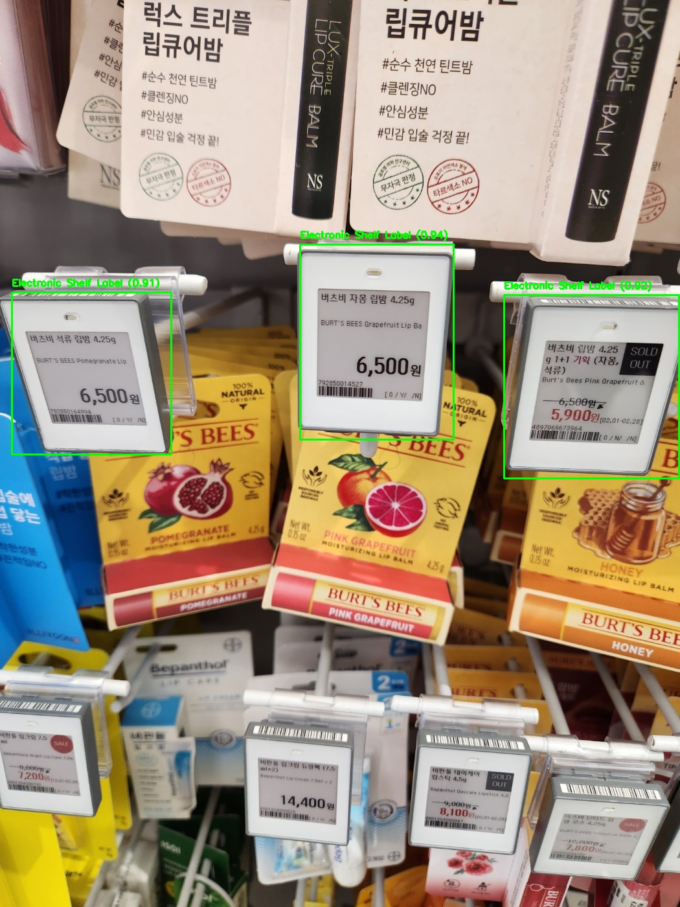

# 소매점 상품 정보 OCR 및 데이터 추출 자동화 시스템


## 프로젝트 개요

본 프로젝트는 소매점 상품 정보가 담긴 이미지에서 텍스트를 자동으로 인식하고(OCR), 대규모 언어 모델(LLM)을 활용하여 구조화된 데이터로 변환하는 시스템입니다. 프로젝트는 **두 가지 독립적인 시스템**으로 구성되어 있습니다:

1. **테이블 이미지 CSV 변환 시스템**: 정형화된 상품 목록 테이블 이미지에서 텍스트를 추출하여 CSV 파일로 직접 변환 (GPT-4o 및 o3-mini 모델 활용)
2. **가격표 인식 및 데이터 추출 시스템**: 소매점 매장 내 가격표를 자동으로 인식하고 상품 정보(코드, 가격 등)를 추출하여 구조화 (GPT-4o 및 Gemini 활용)

두 시스템은 독립적으로 작동하며, 각각 다른 사용 사례와 처리 파이프라인을 가지고 있습니다.

## 시스템 아키텍처

### 1. 테이블 이미지 CSV 변환 시스템
```
[상품 목록 테이블 이미지] → [OCR 텍스트 추출] → [GPT-4o/o3-mini 데이터 정형화] → [CSV 데이터 생성]
```

### 2. 가격표 인식 및 데이터 추출 시스템
```
[매장 이미지 수집] → [YOLOv5 가격표 인식] → [개별 가격표 OCR] → [GPT-4o/Gemini 데이터 구조화] → [통합 데이터셋]
```

## 주요 기능 및 특징

### 1. 테이블 이미지 CSV 변환 시스템
- **전체 테이블 일괄 처리**: 상품 목록이 테이블 형태로 정리된 이미지를 한 번에 처리
- **LLM 기반 데이터 구조화**: GPT-4o(일반 모델) 및 o3-mini(추론 모델)를 활용한 고정밀 데이터 추출
- **열/행 구조 보존**: 테이블의 원래 구조를 유지하면서 CSV 형식으로 변환
- **다양한 상품 카테고리 지원**: 화장품, 생활용품, 식품 등 여러 카테고리의 상품 목록 처리 가능

### 2. 가격표 인식 및 데이터 추출 시스템
- **자동 가격표 감지**: YOLOv5 기반 객체 인식을 통한 가격표 영역 자동 탐지
- **다중 가격표 처리**: 한 이미지 내 여러 가격표 동시 처리 가능
- **세부 정보 추출**: 상품코드, 상품명, 규격, 가격, 할인정보 등 핵심 데이터 자동 추출
- **이미지 전처리**: 가격표 영역 분할 및 텍스트 가독성 향상을 위한 이미지 보정 작업
- **멀티 모델 지원**: GPT-4o와 Gemini 2.0 모델을 활용한 가격표 정보 추출 (Gemini가 이 작업에 더 높은 성능 발휘)

## 결과 예시

### 1. 테이블 이미지 CSV 변환 결과
```csv
판매 코드,상품명,규격,기준가,행사가,Promotion 세부정보,비고
8809278716185,Nan,Nan,Nan,Nan,Nan,Nan
8809278716253,궁중비책 프리뮨 모이스처 로션,Nan,Nan,Nan,Nan,Nan
8809278716208,궁중비책 프리뮨 로션기획,Nan,Nan,Nan,Nan,Nan
8809278716215,궁중비책 프리뮨 크림,350ML,17100,9900,Nan,Nan
8809278715416,프리뮨 수딩 파우더,350ML+50ML*2EA,35000,11900,Nan,Nan
...
```

### 2. 가격표 인식 및 데이터 추출 결과 (Gemini 모델 활용)



```csv
상품명,용량,상품코드,정상가,할인가,할인내용
질레트 랩스 래피드 쉐이브젤,198ML,184987176132284,15900원,15900원,1+1
니베아 선세럼,90ML,3940058089847,19500원,9750원,2개 이상 개당
카밀 바디로션 (클래식),500ML,104000196935649,12900원,8900원,05/01-05/14
dm 발레아 리치 바디 로션,400ML,5406644736602,4900원,3900원,05/01~05/14
...
```

## 기술 스택

- **OCR 엔진**: Upstage Document AI OCR API
- **데이터 처리**: 
  - OpenAI GPT-4o (테이블 및 가격표 시스템)
  - o3-mini (테이블 시스템)
  - Google Gemini 2.0 Flash (가격표 시스템)
- **데이터 구조화**: LangChain을 통한 프롬프트 엔지니어링
- **객체 인식**: YOLOv5 (가격표 감지용 커스텀 학습 모델)
- **개발 환경**: Python 3.12, Jupyter Notebook

## 기술적 세부사항

### 1. 테이블 이미지 CSV 변환 시스템

#### 처리 파이프라인
1. **이미지 입력**: 상품 목록 테이블 이미지 로드
2. **OCR 처리**: Upstage Document AI OCR API를 통한 텍스트 추출
3. **LLM 구조화**: 추출 텍스트를 특화된 프롬프트로 GPT-4o 또는 o3-mini 모델에 전달하여 테이블 구조 복원
4. **CSV 저장**: 구조화된 데이터를 CSV 파일로 변환

#### 프롬프트 엔지니어링
- **ocr06.yaml**: OpenAI GPT-4o 모델용 프롬프트 템플릿 - 테이블 구조 인식 강화
- **ocr_o3.yaml**: Upstage o3-mini 모델용 최적화된 프롬프트 템플릿

```python
# 테이블 이미지 CSV 변환 시스템 핵심 코드
with open(os.path.join(image_folder, filename), "rb") as file:
    files = {"document": file}
    response = requests.post(ocr_url, headers=headers, files=files)
    ocr_data = response.json()

texts = [page.get("text", "") for page in ocr_data.get("pages", [])]
data = texts[0].replace(",", "")

result = chain.invoke(
    {"context": data, "question": "context를 csv 형식으로 변환해줘"}
)

# CSV 저장 로직
```

### 2. 가격표 인식 및 데이터 추출 시스템

#### 처리 파이프라인
1. **이미지 입력**: 매장 내 상품 진열대 이미지 수집
2. **가격표 감지**: YOLOv5 모델을 통한 가격표 영역 자동 인식
3. **영역 추출**: 감지된 가격표 영역 추출 및 개별 이미지로 저장
4. **OCR 처리**: 개별 가격표 이미지에 OCR 적용
5. **데이터 구조화**: GPT-4o 또는 Gemini 2.0을 통한 가격표 정보 구조화 (Gemini 성능이 더 우수)
6. **결과 통합**: 추출된 모든 가격표 정보를 통합 데이터셋으로 구성

#### Gemini 2.0 구현
```python
# Gemini 2.0 모델을 사용한 가격표 정보 추출
def ask_for_product_info(image_path):
    img = Image.open(image_path)
    
    response = model.generate_content(
        [
            "Instructions:\
            1. Detect the price tags in the image and extract the text from those price tags.\
            2. For each price tag (label), identify the following items:\
               - Product name\
               - Capacity\
               - Product code (13 digits)\
               - Regular price (in KRW)\
               - Discount price (in KRW)\
               - Discount content\
            3. If the discount price is not provided, use the same value as the regular price.\
            4. Always add '원' after the price.",
            img,
        ]
    )
    
    return response.text
```

#### 객체 감지 알고리즘
- **모델**: YOLOv5 커스텀 학습 모델
- **학습 데이터**: 다양한 소매점 환경에서 촬영된 1,000여 장의 가격표 이미지
- **클래스**: Electronic Shelf Label(전자 가격표)
- **성능 지표**: mAP@0.5 = 0.91, Precision = 0.88, Recall = 0.93

```python
# 가격표 인식 시스템 핵심 코드
# YOLOv5 객체 감지
result = client.run_workflow(
    workspace_name="n2solution",
    workflow_id="custom-workflow-5",
    images={"image": image_path},
)

# 감지된 가격표 영역 처리
for idx, pred in enumerate(predictions):
    # 좌표 계산
    left = int(pred["x"] - pred["width"] / 2)
    top = int(pred["y"] - pred["height"] / 2)
    right = int(pred["x"] + pred["width"] / 2)
    bottom = int(pred["y"] + pred["height"] / 2)
    
    # 가격표 영역 크롭
    crop = image[top:bottom, left:right]
    cv2.imwrite(crop_path, crop)
    
    # 개별 OCR 및 데이터 추출 로직...
```

## 프롬프트 엔지니어링 기법 분석

본 프로젝트에서는 각 시스템에 최적화된 프롬프트 엔지니어링 기법을 적용하여 OCR 데이터 구조화 정확도를 향상시켰습니다.

### 적용된 주요 프롬프트 엔지니어링 기법

#### 1. 테이블 이미지 CSV 변환 시스템의 프롬프트 엔지니어링

**스키마 기반 구조화 (Schema-Based Structuring)**
- 12개 열에 대한 명확한 데이터 타입 및 제약조건 정의
- CSV 형식의 엄격한 출력 구조 강제
- **효과**: 복잡한 테이블 구조에서도 일관된 데이터 추출 가능

**언어 최적화 분리 (Language-Optimized Separation)**
- GPT-4o: 영어 기반 간결한 지시문 사용 ("must not contain missing contents")
- o3-mini: 한국어 컨텍스트에 최적화된 상세 지침 ("빈값(확인 불가)은 Nan으로 기재하십시오")
- **효과**: 각 모델의 언어 처리 특성에 맞춘 지시 방식 채택

**예외 케이스 명시 (Exception Case Declaration)**
- 빈 값 처리 표준화 ("if there is no value in the column, write 'Nan'")
- 특수문자 처리 지침 (쉼표, 결측치 등의 처리 방법)
- **효과**: 불완전한 테이블과 비정형 데이터에 대한 강건성 확보

**시각적 계층화 (Visual Hierarchical Structuring)**
- 마크다운 문법(###, ---)을 활용한 프롬프트 구조화
- 예시 영역 분리를 통한 맥락 이해 강화
- **효과**: 복잡한 지시에서 중요 정보의 시각적 구분으로 모델 이해도 향상

#### 2. 가격표 인식 및 데이터 추출 시스템의 프롬프트 엔지니어링

**멀티모달 컨텍스트 조정 (Multimodal Context Tuning)**
- 이미지-텍스트 통합 프롬프팅으로 시각 정보와 명령 동시 제공
- 시각적 요소(가격표) 인식 및 텍스트 추출 단계 명확화
- **효과**: 복잡한 소매점 환경에서 가격표 식별 및 정보 추출 정확도 향상

**단계적 태스크 분해 (Sequential Task Decomposition)**
- "1. Detect the price tags... 2. For each price tag..." 형식의 명확한 단계 정의
- 가격표 감지 → 정보 식별 → 데이터 구조화의 순차적 파이프라인
- **효과**: 복잡한 인지 작업의 단계적 분해로 처리 정확도 증가

**도메인 특화 규칙 정의 (Domain-Specific Rule Definition)**
- 가격 표기 규칙 ("Always add '원' after the price")
- 용량 표기 정규화 ("4,5G로 인식될 경우 4.5G로 출력")
- 할인가 처리 규칙 ("[용량]당 가격은 할인가가 아니므로...")
- **효과**: 소매업 도메인 특화 데이터 형식에 최적화된 출력 생성

**실패 허용 프로토콜 (Failure-Tolerant Protocol)**
- 불확실성 처리 지침 ("If any item is incorrect or unclear, please write '식별불가'")
- 완전 실패 시나리오 처리 ("If, for any reason, none of the items can be found...")
- **효과**: 인식 실패 시에도 일관된 출력 형식 유지 및 실패 원인 식별 용이

### 시스템별 최적화 전략 및 성과

#### 1. 테이블 이미지 CSV 변환 시스템
- **주요 기법**: 스키마 기반 구조화, 예외 케이스 명시, 다중 예시 학습(Few-Shot Learning)
- **성능 결과**: 
  - GPT-4o: 95-98% 추출 정확도, 2-3초/이미지 처리 속도
  - o3-mini: 90-95% 추출 정확도, 3-5초/이미지 처리 속도
- **특화된 장점**: 복잡한 테이블 레이아웃에서도 열/행 구조 보존 및 정확한 데이터 매핑

#### 2. 가격표 인식 및 데이터 추출 시스템
- **주요 기법**: 멀티모달 컨텍스트 조정, 단계적 태스크 분해, 도메인 특화 규칙 정의
- **성능 결과**:
  - Gemini 2.0: 92-95% 추출 정확도, 1-3초/이미지 처리 속도
  - GPT-4o: 85-90% 추출 정확도, 3-5초/이미지 처리 속도
- **특화된 장점**: 다양한 소매점 환경의 이질적 가격표 인식 및 통합 데이터셋 자동 구성

본 프로젝트의 프롬프트 엔지니어링 접근 방식은 각 시스템의 특성과 목표에 맞게 최적화되어, 텍스트 인식 단계에서 발생할 수 있는 오류를 효과적으로 보정하고 원시 OCR 데이터를 구조화된 형식으로 변환하는 데 중요한 역할을 수행했습니다.

## 모델 성능 비교

| 모델 | 시스템 | 추출 정확도 | 처리 시간 | 비용 효율성 |
|------|--------|------------|-----------|------------|
| GPT-4o | 테이블 변환 | 95-98% | 2-3초/이미지 | 중간 |
| o3-mini | 테이블 변환 | 90-95% | 3-5초/이미지 | 낮음 |
| YOLOv5 + GPT-4o | 가격표 인식 | 85-90% | 3-5초/이미지 | 낮음 |
| YOLOv5 + Gemini 2.0 | 가격표 인식 | 92-95% | 1-3초/이미지 | 높음 |

## 멀티 모델 비교 분석

### Gemini 2.0 vs GPT-4o (가격표 인식 시스템)
- **Gemini 2.0 장점**: 
  - 가격표 인식 및 데이터 추출에서 월등한 성능 (92-95% 정확도)
  - 처리 속도가 GPT-4o 대비 약 1.5-2배 빠름
  - 한국어 가격표에서 숫자 인식 정확도가 높음
  - 비용 효율성이 우수함
- **Gemini 2.0 단점**:
  - 일부 복잡한 할인 정보에서 오류 발생 가능성
  - 특수 기호 인식에서 간혹 오류 발생

### GPT-4o vs o3-mini (테이블 변환 시스템)
- **GPT-4o 장점**:
  - 테이블 구조 분석에서 더 높은 정확도 (95-98%)
  - 복잡한 테이블 레이아웃에 대한 이해력 우수
  - 처리 시간이 상대적으로 빠름
- **o3-mini 장점**:
  - 자연어 처리에 강점 보유
  - 오프라인 환경에서도 사용 가능한 배포 용이성
- **o3-mini 단점**:
  - 추론 모델로써 실질적인 비용과 시간이 더 많이 소요됨
  - 매우 복잡한 테이블 형식에서는 GPT-4o 대비 정확도 하락
  - 컨텍스트 이해력이 제한적

## 한계 및 향후 개선 방향

### 테이블 변환 시스템 한계
- 복잡한 테이블 구조(병합된 셀, 비정형 레이아웃)에서 정확도 저하
- 이미지 품질(해상도, 왜곡, 회전)에 따른 OCR 성능 편차
- 반복 패턴 인식 시 간헐적 오류 발생

### 가격표 인식 시스템 한계
- 조명 조건, 반사, 가려짐 등에 의한 가격표 인식률 변동
- 다양한 가격표 디자인/형식에 대한 적응력 제한
- 밀집된 가격표 구분의 어려움

### 향후 개선 방향
1. 이미지 품질에 따른 자동 보정 시스템 구현
2. 복잡한 테이블 구조 인식을 위한 LLM 프롬프트 최적화
3. 더 다양한 가격표 형태를 인식하기 위한 YOLOv5 모델 확장 학습
4. 온-디바이스 실시간 처리를 위한 모델 경량화
5. 테이블 변환 시스템에서 GPT-4o를 주 모델로 활용
6. 가격표 인식 시스템에서 Gemini 2.0을 주 모델로 활용
7. 카테고리별 특화 프롬프트 개발 및 적용

## 참고 자료

- [Upstage Document AI 공식 문서](https://docs.upstage.ai)
- [OpenAI GPT-4o 문서](https://platform.openai.com/docs/guides/vision)
- [Google Gemini API 문서](https://ai.google.dev/docs)
- [LangChain 공식 문서](https://python.langchain.com/docs/get_started)
- [YOLOv5 GitHub 저장소](https://github.com/ultralytics/yolov5) 