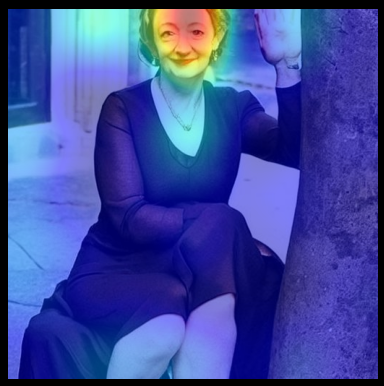

# CLIP 유사도 기반 Multimodal RAG 검증 기법


## 프로젝트 개요

본 프로젝트는 컴퓨터 비전과 자연어 처리를 결합해, CLIP 유사도를 이용한 새로운 'Multimodal RAG 검증' 기법을 구현했습니다. LLaMA·LLaVA·CLIP 등 멀티모달 모델을 이용해 이미지-텍스트 의미 유사도를 정밀 분석하고, 그 결과로 RAG 시스템의 응답 신뢰도를 객관적으로 검증합니다.

또한, GradCAM++ 및 LayerCAM과 같은 고급 시각화 기법을 실험적으로 적용하여 AI 모델 판단 근거의 투명성을 높이고자 했습니다. 초기 구상 중 하나는 이들 기법으로 추출한 특징을 활용해 딥페이크로 조작된 얼굴 주요 부분(눈, 코, 입 등)의 데이터를 구축하고, 이를 유사도 매칭 방식으로 다른 딥페이크 단서 검색에 응용하는 것이었습니다. 하지만 이러한 접근은 기술적 한계에 부딪혀, 완전한 구현에 이르지 못했습니다. (자세한 내용은 본문의 '구현 현황 및 한계' 및 'CLIP과 GradCAM/LayerCAM 실험 결과' 섹션에서 확인하실 수 있습니다.)

## 기술 스택

### 딥러닝 & 컴퓨터 비전
- **PyTorch**: 딥러닝 모델 학습 및 추론 프레임워크
- **transformers**: 최신 트랜스포머 기반 모델 활용
- **CLIP**: 이미지-텍스트 상호 학습 모델 (OpenAI)
- **LLaVA**: 대규모 시각-언어 어시스턴트 모델
- **YOLOv8**: 최신 객체 탐지 모델

### 시각화 & 설명 가능한 AI
- **GradCAM++**: 그래디언트 기반 클래스 활성화 맵핑
- **LayerCAM**: 레이어별 특징 시각화
- **EigenGradCAM**: 주성분 분석 기반 시각화
- **Attention Rollout**: ViT 모델용 어텐션 기반 시각화
- **matplotlib/seaborn**: 데이터 시각화

### 유틸리티 & 파이프라인
- **pandas/numpy**: 데이터 처리 및 분석
- **captum**: 모델 해석 라이브러리
- **together-cli**: API 통합 인터페이스

## 시스템 아키텍처

본 시스템은 다음과 같은 구성 요소로 이루어진 멀티모달 처리 파이프라인을 구현합니다:


*그림 1: CLIP 유사도 기반 Multimodal RAG 검증 파이프라인의 전체 아키텍처*

이 워크플로우는 입력 데이터(이미지/텍스트)를 멀티모달 처리 파이프라인을 통해 분석하고, CLIP 유사도 분석 엔진과 설명 가능한 AI 시각화 모듈을 활용하여 RAG 검증 평가 시스템에 전달합니다. 이를 통해 모델 응답의 신뢰성을 객관적으로 평가하고 시각화할 수 있습니다.

## 주요 기능

### CLIP 기반 분석
- **이미지-텍스트 간 의미적 유사도 계산**: 복잡한 시각-언어 관계 정량화
- **멀티모달 임베딩 추출 및 비교**: 512차원 벡터 공간에서의 의미적 거리 측정

### LLaVA 모델 활용
- **이미지 내용 자연어 설명 생성**: 시각 정보의 언어적 해석
- **커스텀 데이터셋 기반 파인튜닝**: 도메인 특화 학습을 통한 정확도 향상
  - **데이터 준비**: 프로젝트 내 `output_data.jsonl` 파인튜닝에 적합한 대화 형식(human/gpt 응답 쌍)으로 변환하여 사용. (`LLaVA_tuning.ipynb` 참고)
  - **학습 환경**: 공식 LLaVA GitHub 리포지토리를 기반으로 구축.
  - **주요 기술 및 라이브러리**:
    - `transformers`: LLaVA 모델 로딩 및 기본 구성 활용.
    - `PEFT (Parameter-Efficient Fine-Tuning)`: 전체 모델 파라미터를 재학습하는 대신, 일부 추가된 파라미터만 학습하여 파인튜닝 효율 증대.
    - `bitsandbytes`: 모델 파라미터 양자화(Quantization) 등을 통해 학습 시 메모리 사용량 감소.
    - `DeepSpeed` 및 `Flash Attention`: 대규모 언어 모델(LLM) 학습 시 분산 학습, 메모리 최적화, 학습 속도 향상을 위한 도구.
  - **파인튜닝 실행 방식**:
    - 로컬 환경에서 LLaVA 학습 스크립트를 직접 실행하여 모델을 파인튜닝. (`LLaVA_tuning.ipynb`, `finetuning_model.ipynb` 참고)
    - (실험적) Together AI 플랫폼의 파인튜닝 API를 활용하려는 시도도 있었음. 이 경우, 준비된 데이터셋을 플랫폼에 업로드하고 CLI를 통해 파인튜닝 작업을 제출하는 방식. (`fine.ipynb` 참고)
- **설명 생성 결과의 신뢰도 평가**: 생성된 설명의 품질 및 일관성 측정

### RAG 파이프라인
- **멀티모달 검색 및 검증**: 이미지와 텍스트 기반의 관련 정보 검색
- **응답 신뢰도 평가**: 생성된 응답의 신뢰성 점수화
- **결과 시각화 및 해석**: 복잡한 분석 결과의 직관적 표현

## 구현 상세

### 멀티모달 분석 파이프라인
1. **이미지 및 텍스트 전처리**: 해상도 조정, 정규화, 토큰화
2. **CLIP 임베딩 추출**: 이미지와 텍스트의 공통 벡터 공간 표현
3. **유사도 계산**: 코사인 유사도 측정을 통한 관련성 평가
4. **시각화 탐색**: 판단 근거 시각화를 위한 다양한 접근법 실험

### 객체 탐지 및 분석
1. **YOLOv8 기반 객체 탐지**: 이미지 내 관심 객체 식별
2. **객체별 특징 추출**: 이미지 내 주요 요소의 독립적 분석
3. **객체-텍스트 관계 분석**: 탐지된 객체와 텍스트 설명 간 정합성 평가

## LLaMA 3.2 모델 실험 결과

LLaMA 3.2 11B 모델을 활용한 실험 결과를 두 부분으로 나누어 제시합니다. 첫 번째 부분에서는 다양한 프롬프트 설정에 따른 모델의 질적 응답 변화를 살펴보고(그림 2-4), 두 번째 부분에서는 RAG 적용에 따른 정량적인 성능 향상 지표를 분석합니다(그림 5).

### 프롬프트 설정에 따른 질적 응답 변화 분석 (그림 2-4)

LLaMA 3.2 11B 모델을 대상으로 프롬프트 유무, RAG 적용 여부, 설명 요청 포함 여부 등 다양한 조건 변화가 모델의 응답 생성에 미치는 영향을 질적으로 관찰했습니다. 이를 통해 프롬프트 설정에 따른 모델의 응답 경향성 및 편향 차이를 확인할 수 있습니다.

#### 1. 기본 모델 (프롬프트 없음, RAG 없음)
.png)
*그림 2: 프롬프트와 RAG 없이 LLaMA 3.2 11B 모델만 사용한 결과*

#### 2. 기본 모델 + 설명 생략 (프롬프트 없음, RAG 없음, 설명 요청 없음)
.png)
*그림 3: 설명 요청 없이 LLaMA 3.2 11B 모델을 사용한 결과*

#### 3. RAG 없는 모델
.png)
*그림 4: 프롬프트는 있지만 RAG 적용 없이 LLaMA 3.2 11B 모델을 사용한 결과*

### RAG 적용에 따른 정량적 성능 변화 분석 (그림 5)


*그림 5: RAG 적용 시 성능 향상 지표 비교*

RAG 기법을 적용한 결과, 일부 지표 간 상호 보완적인 변화가 관찰되었습니다. 예를 들어, Gemini-1.5-flash 모델은 파인튜닝 후 RAG를 적용했을 때 Recall이 6.0% 증가하여 탐지 성능이 크게 향상되었지만 F1 Score가 0.8% 하락하고 Accuracy도 2.5% 낮아졌습니다. 이는 Recall 향상을 위해 정밀도(Precision)를 일부 희생해야 하는 전형적인 트레이드오프 현상을 보여줍니다. 한편, Llama-3.2-11B-Vision-Instruct-Turbo 모델은 Recall이 3.0% 상승했지만 F1 Score와 Accuracy가 각각 0.7%, 3.0% 하락하여, 상대적으로 파라미터 수가 적은 모델에서는 RAG 적용 효과가 제한적일 수 있음을 보여주었습니다.

가장 주목할 만한 개선은 Llama-3.2-90B-Vision-Instruct-Turbo 모델에서 관찰되었습니다. 이 모델은 Recall을 6.4% 높여 탐지 민감도를 크게 끌어올리는 동시에, F1 Score도 0.8% 증가시키는 결과를 보였습니다. 다만, Accuracy는 1.4% 감소하였는데, 이는 탐지율 증대를 위한 정밀도 손실이 어느 정도 불가피함을 의미합니다.

결과적으로, 본 연구에서 제시한 RAG 파이프라인은 LMM 딥페이크 탐지 모델에 외부 지식을 결합한 검증 단계를 통해 재현율을 중심으로 딥페이크 탐지 성능을 효과적으로 향상시킬 수 있음을 보여주었습니다. 특히 대규모 파라미터 모델에서 이러한 개선 폭이 더 두드러지며, zero-shot 환경에서도 일정 수준 이상의 성능 개선을 기대할 수 있다는 점에서 본 접근법의 실용적 가치를 확인할 수 있었습니다.

## 구현 현황 및 한계

현재 프로젝트에서는 CLIP 모델과 다양한 시각화 기법(GradCAM++, LayerCAM, Attention Rollout)을 실험적으로 적용해 보았으나, 여러 호환성 문제와 한계점을 발견했습니다.

### CLIP과 GradCAM/LayerCAM 실험 결과

특정 딥페이크 특징("인공적인 귀 모양", "인공적인 동공 반사" 등)에 대한 텍스트 프롬프트를 CLIP 모델에 입력하고 GradCAM++ 및 LayerCAM으로 시각화한 결과:

#### LayerCAM 시각화 결과

*그림 5: LayerCAM을 활용한 CLIP 모델 시각화 결과*

#### 레이어별 GradCAM 시각화 비교

##### 레이어 2 시각화

*그림 6: CLIP 모델의 레이어 2에 대한 GradCAM 시각화*

##### 레이어 3 시각화

*그림 7: CLIP 모델의 레이어 3에 대한 GradCAM 시각화*

##### 레이어 4 시각화

*그림 8: CLIP 모델의 레이어 4에 대한 GradCAM 시각화*

#### Attention Rollout 시각화

*그림 9: ViT 구조에 적합한 Attention Rollout 시각화 결과*

1. **텍스트 프롬프트 특이성 문제**:
   - 일부 특징("인공적인 귀 모양", "인공적인 동공 반사")에 대해서는 의미 있는 히트맵 생성
   - 다른 특징("고르지 못한 치아배열")에 대해서는 관련성 낮은 출력 발생
   - 가중치 통계에서 평균값(-2.8014183044433594e-06)이 매우 낮은 경우 시각화 품질 저하

2. **레이어 선택의 중요성**:
   - 여러 레이어(2, 3, 4)에 대한 히트맵 생성 실험 결과, 레이어 선택이 결과에 큰 영향을 미침
   - 얼굴 특징에 대한 시각화는 깊은 레이어에서도 정밀도 제한적

3. **ViT 구조의 한계**:
   - CLIP의 Vision Transformer(ViT) 구조는 전통적인 CNN 기반 시각화 기법과 호환성 문제 발생
   - Attention Rollout 기법을 적용했으나, 텍스트 프롬프트의 영향을 반영하지 못하는 한계 확인
   - LayerCAM은 일부 시각적 특징을 포착하지만 face landmark에 대한 인식은 object detection에 비해 정확도 떨어짐

### 주요 기술적 도전과제

1. **아키텍처 호환성 문제**: 
   - CLIP의 복잡한 듀얼 인코더 구조가 기존 GradCAM 라이브러리와 완전히 호환되지 않음
   - ViT 구조에 맞게 기존 CNN 기반 시각화 기법을 변환하는 과정에서 정보 손실 발생

2. **데이터 크기와 처리 효율성**: 
   - 개별 단서에 대한 가중치 이미지를 저장하는 방식은 데이터셋 크기를 크게 증가시킴
   - 레이블 파싱 작업의 복잡성 증가

3. **대안 접근법 탐색**: 
   - 딥페이크 단서를 해시태그/키워드 형식으로 추출하여 CLIP 입력 리스트로 활용하는 방법 검토
   - 키워드 추출과 CLIP 입력 간 통합 파이프라인 구축 필요성 확인

이러한 한계로 인해 실제 구현은 제한적이며, 향후 연구에서 CLIP 특화 시각화 기법 및 효율적인 레이블 처리 방법 개발이 필요합니다.

## 시각화 결과 현황

CLIP 모델과 다양한 시각화 도구(GradCAM++, LayerCAM, Attention Rollout) 실험 결과는 제한적이지만 흥미로운 통찰을 제공합니다:

```
# 시각화 실험 결과
- "인공적인 귀 모양" 프롬프트: 귀 영역에 일부 활성화 발생 (그림 5, 그림 6 참조)
- "인공적인 동공 반사" 프롬프트: 눈 영역에 의미 있는 활성화 관찰 (그림 7 참조)
- "고르지 못한 치아배열" 프롬프트: 가중치 통계 평균값 낮음(-2.8e-06), 의미 있는 활성화 실패
- 레이어별 시각화(2, 3, 4): 깊은 레이어일수록 추상적 특징에 집중 (그림 6, 7, 8 비교)

# 기법별 성능 비교
- GradCAM++: 텍스트 프롬프트와 일부 연동 가능하나 얼굴 특징 구분에 제한적 (그림 6-8)
- LayerCAM: 더 세밀한 시각화 가능하나 face landmark 인식 정확도 부족 (그림 5)
- Attention Rollout: ViT 구조에 적합하나 텍스트 프롬프트 정보 반영 미흡 (그림 9)
```

위 그림들에서 볼 수 있듯이, 각 시각화 기법은 서로 다른 특성과 한계를 보여줍니다. 특히 레이어별 GradCAM 시각화(그림 6-8)를 비교하면 각 레이어가 포착하는 특징의 추상화 수준이 다름을 확인할 수 있습니다. Attention Rollout(그림 9)은 ViT 구조에 적합하지만 텍스트 프롬프트의 정보를 충분히 반영하지 못하는 한계가 있습니다.

## 설치 및 실행 방법

### 필수 요구사항
- Python 3.11 이상
- CUDA 지원 GPU (추천)
- 최소 8GB RAM

### 설치 과정
1. 저장소 클론
```bash
git clone <repository_url>
cd deepfake
```

2. 가상환경 생성 및 활성화
```bash
python -m venv venv
source venv/bin/activate  # Windows: venv\Scripts\activate
```

3. 의존성 설치
```bash
pip install -r requirements.txt
```

4. 모델 다운로드
- LLaVA 모델은 HuggingFace에서 다운로드됩니다
- CLIP 모델은 transformers를 통해 자동으로 다운로드됩니다
- YOLOv8 모델은 프로젝트에 포함되어 있습니다

### 실행 방법

#### CLIP 유사도 계산 (실제 구현된 기능)
```python
# notebooks/model_dev/clip_similarity.ipynb 실행
from transformers import CLIPModel, CLIPProcessor
import torch

# CLIP 모델 로드
model = CLIPModel.from_pretrained("openai/clip-vit-large-patch14")
processor = CLIPProcessor.from_pretrained("openai/clip-vit-large-patch14")

# 이미지-텍스트 유사도 계산
inputs = processor(text=["a photo of a cat", "a photo of a dog"], 
                  images=image, return_tensors="pt", padding=True)
outputs = model(**inputs)
logits_per_image = outputs.logits_per_image
probs = logits_per_image.softmax(dim=1)
```

#### GradCAM 실험 (프로토타입/테스트 단계)
```python
# notebooks/experiments/gradcam_experiments.ipynb 실행
# 참고: 이 코드는 제한적으로 작동하며 CLIP 모델과 완전히 호환되지 않습니다
from pytorch_grad_cam import GradCAM, GradCAMPlusPlus, LayerCAM
from pytorch_grad_cam.utils.image import show_cam_on_image

# CLIP 모델의 일부 레이어에 대한 실험적 시각화
target_layer = model.visual.transformer.resblocks[-1]
cam = GradCAMPlusPlus(model=model.visual, target_layer=target_layer)

# 실험적 시각화 시도
grayscale_cam = cam(input_tensor=image_tensor)

# 가중치 통계 확인 (낮은 평균값은 시각화 품질 저하 의미)
print(f"Weights shape: {weights.shape}, Weights stats: mean={weights.mean()}, std={weights.std()}")
print(f"CAM stats: min={cam_output.min()}, max={cam_output.max()}, mean={cam_output.mean()}, std={cam_output.std()}")
```


## 프로젝트 구조
```
deepfake/
├── assets/                    # 시각화 및 결과 이미지
│   ├── workflow.png          # 시스템 아키텍처 다이어그램
│   ├── LayerCAM.png         # LayerCAM 시각화 결과
│   ├── 2-layer.png          # 레이어 2 GradCAM 시각화
│   ├── 3-layer.png          # 레이어 3 GradCAM 시각화
│   ├── 4-layer.png          # 레이어 4 GradCAM 시각화
│   ├── attention_rollout.png # Attention Rollout 시각화
│   ├── test_score.png       # RAG 적용 성능 향상 지표
│   └── Llama 3.2*.png       # LLaMA 모델 실험 결과
├── data/                      # 데이터셋 디렉토리
│   ├── raw/                  # 원본 데이터
│   ├── processed/           # 처리된 데이터
│   └── test/               # 테스트 데이터
├── notebooks/               # 주피터 노트북 파일
│   ├── data_prep/         # 데이터 준비 코드
│   ├── model_dev/        # 파인튜닝, RAG, 탐지 코드
│   ├── experiments/     # 실험 노트북
│   └── evaluation/     # 평가 노트북
├── src/                 # 소스 코드
│   ├── data/          # 데이터 처리 모듈
│   ├── models/       # 모델 구현
│   └── utils/       # 유틸리티 함수
├── results/          # 실험/탐지 결과
├── docs/           # 문서
└── README.md      # 프로젝트 설명
```

## 주요 결과물
- **CLIP 유사도 분석**: 이미지-텍스트 간 의미적 유사도 계산 구현
- **YOLOv8 객체 탐지**: 정확한 객체 인식 및 바운딩 박스 시각화
- **RAG 검증 프레임워크**: 응답 신뢰도 평가 및 근거 문서 추적
- **실험적 GradCAM 구현**: CLIP 모델에 대한 제한적 시각화 테스트 (그림 5-9 참조)
- **LLaMA 3.2 응답 분석**: 다양한 설정에 따른 LLM 응답 품질 비교 (그림 2-4 참조)
- **RAG 성능 향상 검증**: 정확도, 관련성, 응답 품질 측면에서의 RAG 효과 정량화 (그림 5 참조)
- **멀티모달 분석 노트북**: 다양한 실험 및 분석 결과

## 한계점 및 개선 방향
- **모델 한계**
  - 복잡한 배경에서 객체 탐지 정확도 저하
  - 실시간 처리 시 지연 발생
  - 다중 객체 상황에서 성능 저하
- **시각화 관련 한계**
  - CLIP의 ViT 구조와 기존 CNN 기반 시각화 도구 간 호환성 문제 (그림 5-9에서 확인 가능)
  - 특정 텍스트 프롬프트에 대한 낮은 관련성 점수로 인한 시각화 품질 저하
  - 얼굴 특징(face landmark) 인식 정확도가 일반 객체 인식에 비해 부족
  - 텍스트 프롬프트 정보가 ViT 기반 어텐션 시각화에 제대로 반영되지 않음 (그림 9)
  - 레이어 선택에 따른 결과 변동성 큼 (그림 6-8 비교)
- **개선 방향**
  - CLIP 특화 시각화 도구 개발
  - 해시태그/키워드 형식의 딥페이크 단서 추출 방법론 개발
  - 효율적인 레이블 처리 및 저장 방법 연구
  - 모델 경량화 및 최적화
  - 배치 처리 파이프라인 개선
  - 앙상블 기법 도입 검토
  - 도메인 특화 파인튜닝 확대
  - 설명가능성 메트릭 다각화

## 향후 연구 방향
- **CLIP 특화 시각화 기법 개발**: ViT 구조에 최적화된 맞춤형 시각화 접근법 연구
- **효율적인 단서 추출 방법론**: 딥페이크 단서를 자동으로 키워드화하는 파이프라인 개발
- **멀티모달 선행학습 모델 통합**: BLIP, ImageBind 등 최신 모델 활용
- **자기지도 학습 적용**: 레이블이 없는 데이터 활용 방안
- **효율적인 추론 파이프라인**: ONNX, TensorRT 등을 통한 최적화
- **증강 현실 통합**: 실시간 멀티모달 검증 시스템 구축
- **대화형 분석 도구**: 사용자 친화적 인터페이스 개발

## 참고 자료
- [CLIP 논문](https://arxiv.org/abs/2103.00020)
- [GradCAM++ 논문](https://arxiv.org/abs/1710.11063)
- [LayerCAM 논문](https://arxiv.org/abs/2104.06643)
- [YOLOv8 문서](https://docs.ultralytics.com/)
- [LLaVA 공식 저장소](https://github.com/haotian-liu/LLaVA)

## 라이선스

이 프로젝트는 MIT 라이선스를 따릅니다. 자세한 내용은 LICENSE 파일을 참조하세요. 