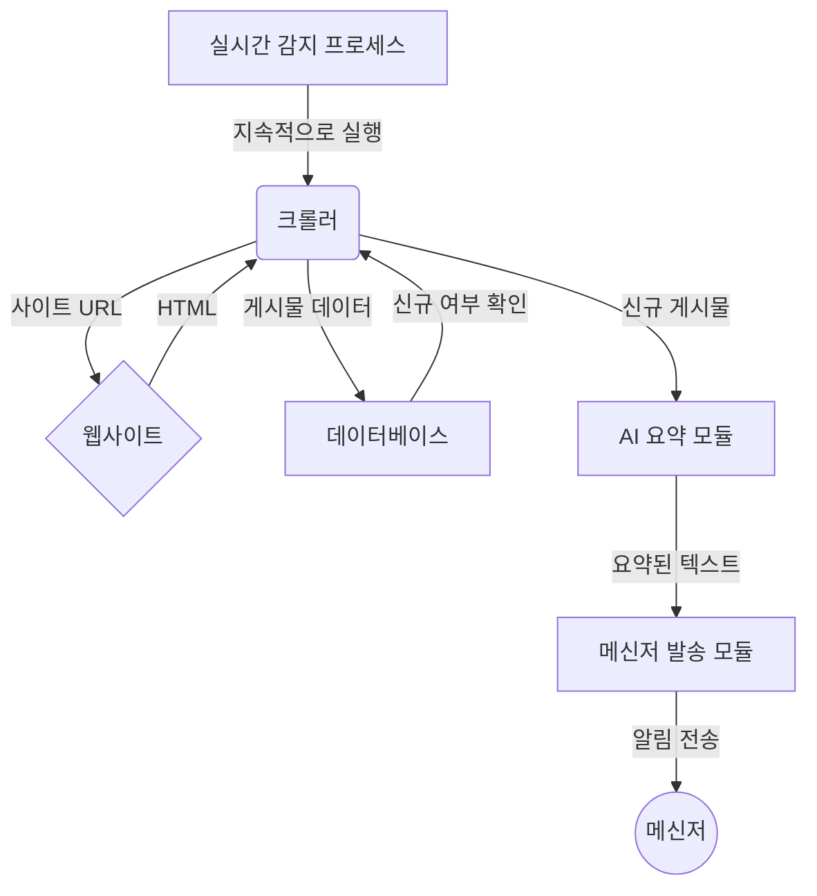

# 디자인 문서(Design Document)

## 1. 개요
이 문서는 특정 웹사이트의 신규 게시물을 크롤링하여 요약하고, 지정된 메신저로 알림을 보내는 AI 시스템의 설계에 대해 기술합니다.

## 2. 시스템 아키텍처
본 시스템은 지속적으로 웹사이트를 감시하는 **실시간 감지 프로세스**, 웹 페이지의 콘텐츠를 가져오는 **크롤러**, 새로운 게시물인지 판별하기 위해 게시물 정보를 저장하는 **데이터베이스**, 게시물 내용을 요약하는 **AI 요약 모듈**, 그리고 요약된 내용을 메신저로 전송하는 **메신저 발송 모듈**로 구성됩니다.

## 3. 주요 기능
- **웹사이트 크롤링**: 사용자가 입력한 URL의 웹사이트에서 게시물을 크롤링합니다.
- **신규 게시물 감지**: 데이터베이스를 통해 이미 처리된 게시물인지 확인하여 신규 게시물만 선별합니다.
- **AI 기반 텍스트 요약**: 크롤링한 게시물의 본문을 AI를 사용하여 핵심 내용만 요약합니다.
- **메신저 알림**: 요약된 내용을 지정된 메신저로 전송합니다.

## 4. 기술 스택 및 메신저 연동 방안

### 4.1. 기술 스택 (제안)
- **언어**: Python
- **크롤링**: `BeautifulSoup`, `requests` or `Playwright`(동적 페이지용)
- **AI 요약**: OpenAI GPT API, Hugging Face Transformers 등
- **데이터베이스**: SQLite (간단한 시작용), PostgreSQL 등
- **스케줄러**: `APScheduler` (Python 라이브러리), `cron` (시스템 레벨)

### 4.2. 메신저 연동 방안
사용자가 요청한 **카카오톡**을 포함하여, 연동 가능한 메신저 플랫폼은 다음과 같습니다.

- **1. 카카오톡 챗봇 (KakaoTalk Chatbot)**
  - **장점**: 카카오톡 채널을 통해 다수의 사용자에게 알림을 보낼 수 있습니다. 챗봇을 통해 향후 양방향 소통 등 기능 확장이 용이합니다.
  - **구현**: 카카오톡 채널 개설 및 챗봇 생성이 필요합니다. 알림을 보낼 백엔드 서버를 구현해야 하며, 해당 서버는 공개적으로 접근 가능해야 합니다. 사용자가 챗봇을 추가해야 알림을 받을 수 있습니다. '나에게 보내기' 방식보다 초기 설정이 복잡합니다.
  - **결론**: 다수 사용자에게 알림을 보내는 목적에 더 적합하며 확장성이 높습니다. **채택 가능한 좋은 선택지**입니다.

- **2. 텔레그램 (Telegram)**
  - **장점**: 봇(Bot) API가 매우 간단하고 사용하기 쉬워 개발 속도가 빠릅니다. 채널이나 개인에게 메시지를 보내는 기능이 강력합니다.
  - **구현**: 'BotFather'를 통해 봇을 생성하고 API 토큰을 발급받아 HTTP 요청으로 간단하게 메시지를 보낼 수 있습니다.

- **3. 슬랙 (Slack)**
  - **장점**: 개발자에게 친숙한 툴이며, Webhook API를 제공하여 특정 채널에 메시지를 보내기 매우 편리합니다.
  - **구현**: Slack App을 생성하고 Incoming Webhooks를 활성화하여 얻은 Webhook URL에 POST 요청을 보내는 방식입니다.

- **4. 디스코드 (Discord)**
  - **장점**: 게이밍 커뮤니티 외에도 널리 사용되며, 웹훅을 이용한 메시지 전송 기능이 강력하고 간단합니다.
  - **구현**: 서버 설정에서 웹훅을 생성하고 해당 URL에 POST 요청을 보내 메시지를 전송합니다.

**결론**: 다수 사용자에게 알림을 보내는 것이 목적이므로 **카카오톡 챗봇** 방식의 구현을 우선적으로 추천합니다. 만약 더 간단한 구현을 원한다면 텔레그램 봇을 사용하는 것도 좋은 대안이 될 수 있습니다.

## 5. 데이터 흐름
1. **실시간 감지 프로세스**가 무한 루프를 돌며 짧은 주기로 **크롤러**를 실행합니다.
2. **크롤러**는 입력받은 URL의 웹페이지 HTML을 가져옵니다.
3. 가져온 HTML에서 게시물 목록을 파싱합니다.
4. 각 게시물의 고유 ID(예: 게시물 URL 또는 제목+날짜)를 이용하여 **데이터베이스**에 이미 존재하는지 확인합니다.
5. 데이터베이스에 없는 신규 게시물일 경우, 해당 게시물의 본문 내용을 추출합니다.
6. 추출된 본문을 **AI 요약 모듈**로 전달하여 요약문을 생성합니다.
7. 생성된 요약문을 **메신저 발송 모듈**을 통해 지정된 메신저로 전송합니다.
8. 처리가 완료된 게시물 정보는 **데이터베이스**에 기록하여 중복 처리를 방지합니다.

## 6. 사용자 입력
- 크롤링할 대상 웹사이트의 URL은 외부 설정 파일(예: `config.ini` 또는 `JSON` 파일)이나 실행 시 인자로 입력받는 형태로 구현합니다. 